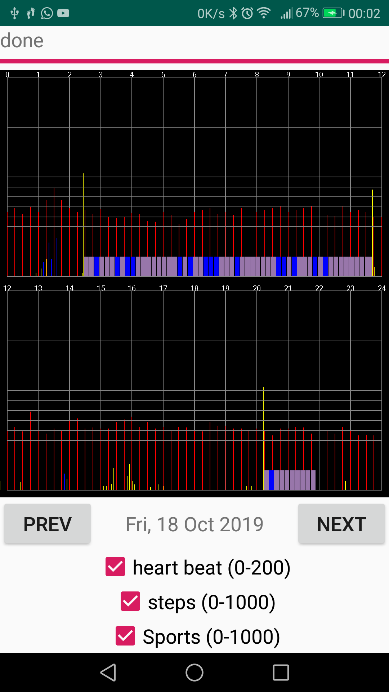

# MPOW DS-D6 Android app
Just a *quick and minimal* Android app for the dsd6 the bracelet.

It loads and displays the following data:
- sleep quality
  - light sleep
  - deep sleep
- heart beat
- steps
- "sports steps"

## App's Permissions
Unlike the oficial app that requires access to all your personal details, this one doesn't require any special permissions other than the position, this is required by the Android's BLE stack to work.

## Future work
This app does pretty much all I was after so unless I receive pull requests I won't be updating it much.

## The ugly
The app is linked to my band hw address and, brace yourself, it happens to be hardcoded :) If you want to use it you need to put your own. Pull requests to select a particular device are welcome :)  

## Screenshot
A huge screenshot is better than no screenshot

